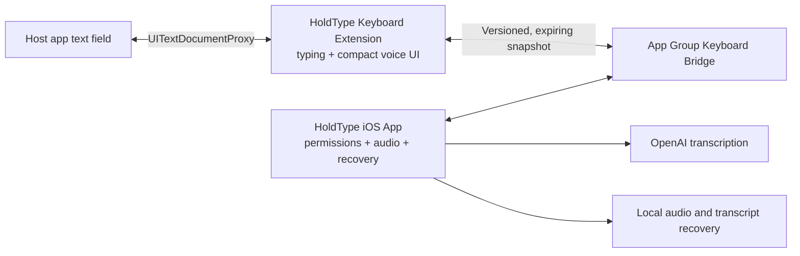

# HoldType iOS Keyboard Development Plan

Status: active feasibility work; canonical roadmap P3 and P4A through P4D-4 are
complete. P4D-5A local technical Release qualification is active, while
P4D-2C, P4D-5B, and keyboard M0B/M0C remain physical-device gates. Started
2026-07-09 and updated 2026-07-13.

The complete containing-app, settings, data, privacy, and macOS feature
portability roadmap lives in `docs/ios-product-portability-plan.md`. This file
keeps ownership of the keyboard-specific feasibility and typing milestones.
The P0-P8 order in that roadmap is canonical; milestone numbers here describe
keyboard dependency lanes, not a competing chronological implementation order.

## Decision

Build toward a familiar, full custom iPhone keyboard with a compact voice
action. Do not try to modify Apple's keyboard, record audio inside the keyboard
extension, or depend on a private automatic-return trick.

The expensive typing engine begins only after a physical-device spike proves
that the voice handoff and accepted-text insertion are reliable enough to be a
product.

## Product And Architecture

Target dependency rule:

- macOS app: existing domain and OpenAI pipeline;
- iOS containing app: portable domain/OpenAI code, app-only orchestration,
  iOS audio, and bridge;
- keyboard extension: keyboard UI, `UITextDocumentProxy`, and bridge only;
- no OpenAI, Keychain, raw audio, or microphone code linked into the extension.

History policy, generation, rows, retry-audio ownership, receipts, and cleanup
status remain permanently app-private. They are not keyboard settings, bridge
commands, or App Group snapshots even after the production directional bridge
exists; Clear History and the History toggle belong only to the containing app.

The long-term code boundaries are `HoldTypeDomain`, `HoldTypeOpenAI`,
`HoldTypePersistence`, app-only `HoldTypeIOSCore`, and
`HoldTypeKeyboardBridge`. The keyboard never links the provider, persistence,
or app-core products. The feasibility spike starts with an isolated bridge
folder so it does not prematurely reorganize the stable macOS target.

## Milestone 0 — Platform Feasibility

### M0A: buildable extension and insertion bridge

- embed a minimal keyboard extension in `HoldType-iOS`;
- provide a normal character key and next-keyboard control;
- publish a harmless sample transcript from the containing app;
- load the sample from the App Group and insert it through
  `UITextDocumentProxy`;
- unit-test normalization, expiry, schema compatibility, and atomic round trip;
- verify the app bundle contains the `.appex` and the processed extension plist
  declares `com.apple.keyboard-service`.

No mic, network, background mode, Keychain sharing, or app-launch behavior is
part of M0A.

### M0B: physical keyboard constraints

Test on current iPhone and iPad hardware:

- select the same operator-local Apple Developer Team for the app and extension,
  register both App IDs and `group.app.holdtype.HoldType.shared`, and regenerate
  provisioning profiles; no team identifier is committed to the repository;
- keyboard enable/disable and next-keyboard behavior;
- App Group read with Full Access off;
- explicit `UITextDocumentProxy` Insert from that read-only path with Full
  Access off; keyboard-level Copy is not part of this promise;
- a separately justified debug matrix with Full Access on/off before enabling
  extension writes;
- secure, phone, email, multiline, and host-opt-out fields;
- portrait, landscape, docked, and floating layouts;
- keyboard process eviction and stale/expired snapshots.

### M0C: voice-session handoff

Validate one selected public-API product hypothesis:

1. The user explicitly activates a five-minute Quick Session in HoldType.
2. The user manually returns to the host and reselects HoldType with Globe when
   iOS leaves Apple's keyboard active.
3. The containing app keeps the microphone/audio engine visibly active for the
   bounded session. While armed but not `listening`, it discards incoming samples
   immediately and never persists or uploads them.
4. With disclosed Full Access, the keyboard sends only the phase-valid named
   voice-action and insertion-acknowledgement commands while that session is
   active, plus the content-free readiness heartbeat defined by the shared-state
   spec.
5. Expiry, Stop, interruption, app termination, and force quit close the session
   and microphone deterministically.
6. With Full Access off, the extension remains a working keyboard and read-only
   transcript insertion surface; manual app recording remains available.
7. When HoldType voice is inactive, use a system Dictation control if iOS shows
   one, otherwise Globe to Apple's keyboard and start Dictation there.
8. If keyboard-level Copy is proposed, validate explicit `UIPasteboard` use
   separately with Full Access; otherwise keep Copy in the containing app.

The keyboard never launches the containing app or relies on an automatic return
API. One-shot app recording is the safe fallback, not a competing default flow.

`UIBackgroundModes=audio` may be added only to the isolated M0C build after the
foreground app-only slice is complete. It supports only a foreground-started
Quick Session, never network/extension lifetime. If M0C fails, remove it from
the release target.

Every completed recording is stored locally before provider work. Automatic
insertion is disabled if the current `documentIdentifier` does not match the
session target.

### M0 go/no-go gate

Use at least Notes, Messages, Mail, Safari, and two third-party apps. The gate
passes only when repeated short sessions show:

- no lost completed recording;
- no silent insertion into the wrong field;
- no duplicate insertion from late results;
- deterministic Stop, timeout, interruption, and force-quit microphone shutdown;
- after Start, the complete path back to a HoldType-ready host field takes at
  most two explained actions: return and optional Globe re-selection;
- ordinary keyboard fallback remains available throughout.

If this gate fails, stop before full QWERTY and evaluate a companion app plus
Shortcut/App Intent workflow.

## Milestone 1 — Portable Core Extraction

- begin with only `AcceptedTranscript` in `HoldTypeDomain`, keeping the old
  macOS path as a compatibility facade and excluding the obsolete M0A
  open-containing-app session prototype;
- extract platform-neutral accepted-text, transcription configuration,
  post-processing, and error contracts;
- extract the Foundation-only OpenAI request pipeline without changing macOS
  behavior;
- introduce the versioned keyboard bridge as an explicit module or framework;
- keep all current macOS tests green;
- add real cancellation and mobile-safe file-backed upload before long audio is
  supported.

## Milestone 2 — iOS Containing App Vertical Slice

This lane maps to P3-P5 of the canonical portability roadmap and remains
foreground-only until P6/M0C passes.

- explain the platform/manual-return limit;
- add and enable HoldType Keyboard;
- explain ordinary typing and the M0B-proven read-only insertion mode without
  requesting Full Access yet;
- configure the user's BYOK API key and request microphone permission;
- choose the implemented typing layout and dictation language;
- run a guided real dictation and recovery example;
- teach Globe re-selection, system emoji, Space cursor movement, and conditional
  Apple Dictation fallback;
- microphone permission and `AVAudioSession` lifecycle;
- record, stop, transcribe, normalize, and retain recoverable audio;
- publish accepted text to the bridge;
- bounded timeouts, cancellation, interruptions, route changes, and offline
  recovery.

This milestone must not expose Quick Session, request Full Access for commands,
or declare an audio background mode. The fixed five-minute Quick Session is the
later P6/M0C hypothesis.

## Milestone 3 — iPhone Typing Foundation

Only after M0 passes:

- QWERTY, numbers, symbols, Shift/Caps Lock, Delete repeat, Space, Return, Globe;
- auto-capitalization, double-space period, callouts, hit slop, and haptics;
- local autocorrection, predictions while voice is idle, and correction Undo;
- field traits, portrait/landscape, small/standard/Max iPhones, light/dark mode;
- Space cursor trackpad and system emoji switching;
- VoiceOver and Reduce Motion;
- a compact action bar reserved for mic and voice status.
- set `hasDictationKey = true` only when that production voice key ships, then
  verify on physical iPhone/iPad that iOS does not add a duplicate Dictation
  key; the Phase 0 spike remains false.

M3 entry gate: approve the first-release typing layouts and dictionaries,
dictation languages, auto-detect policy, and the relationship between keyboard
locale and dictation language. The Phase 0 `en-US` metadata is not that decision.

Evaluate KeyboardKit separately before this milestone. It can shorten layout,
locale, and autocomplete work, but introduces a closed-source binary/pro
license, startup/memory, and vendor risk. The platform handoff must not depend
on a library-specific app-opening workaround.

Typing gate: the keyboard must be usable as the primary keyboard for a normal
working day without recurring blocker failures in tap accuracy, Space, Delete,
Return, Globe, cursor movement, or common field types.
Routine autocorrection and predictions must reduce repair work rather than make
users switch back to Apple's keyboard.

## Milestone 4 — Voice UX And Hardening

- dedicated mic in the compact action bar;
- `needsActivation`, `arming`, `ready`, `listening`, `finalizing`, `processing`,
  `confirmedInserted`, `deliveryUnverified`, `recoverableFailure`, and
  distinct `interrupted` and `expired` states;
- literal plus punctuation by default; AI polish is explicit;
- Retry/Insert where eligible plus instructions to use containing-app Latest
  Result or History for Copy; keyboard-level Copy appears only after its
  separate Full Access/`UIPasteboard` physical-device gate;
- durable extension-local pre-insert claims so missing acknowledgements or
  process restart cannot replay an insertion; retain at most 512 active claims
  for 24 hours, and fail closed on a 513th live claim without evicting an
  unexpired duplicate barrier;
- repeated start/stop/process cycles, network changes, device lock, calls, Siri,
  AirPods changes, Low Power Mode, and app switching;
- TestFlight dogfood, privacy manifests, App Privacy disclosure, and App Review
  checklist.

## Milestone 5 — iPad Product

Begin after the iPhone gates pass:

- docked and floating keyboard layouts;
- landscape-first geometry and Stage Manager/multi-window safety;
- Magic Keyboard and Bluetooth-keyboard workflow;
- App Intent/Shortcut as a secondary voice trigger when the onscreen keyboard is
  hidden;
- explicit protection against insertion into the wrong window.

Do not market full iPad support until the hardware-keyboard path is usable in no
more than two clear actions.

## Verification Matrix

- Pure models and bridge: Swift unit tests with temporary local storage.
- Target composition: iOS simulator build/test with signing disabled.
- Extension embedding: inspect built app bundle and processed plist.
- Visual/layout smoke: iPhone and iPad simulators after a host harness exists.
- Full Access, secure fields, keyboard switching, lifecycle, app return, audio,
  and process eviction: physical devices only.
- OpenAI: fake-backed tests by default; no live provider call in normal tests.

Each completed physical-device pass belongs in `docs/qa/runs/` with OS/device,
host app, state, expected result, actual result, and go/no-go decision.

## Research Basis

- Apple custom keyboards:
  `https://developer.apple.com/documentation/uikit/creating-a-custom-keyboard`
- Apple Open Access:
  `https://developer.apple.com/documentation/uikit/configuring-open-access-for-a-custom-keyboard`
- Apple App Review Guidelines:
  `https://developer.apple.com/app-store/review/guidelines/`
- Apple DTS round-trip limitation:
  `https://developer.apple.com/forums/thread/826851`
- Apple Dictation and Space cursor gesture:
  `https://support.apple.com/guide/iphone/dictate-text-iph2c0651d2/ios`
  `https://support.apple.com/guide/iphone/type-with-the-onscreen-keyboard-iph3c50f96e/ios`
- Wispr Flow setup and iOS 26.4 handoff:
  `https://docs.wisprflow.ai/articles/7453988911-set-up-the-flow-keyboard-on-iphone`
  `https://docs.wisprflow.ai/articles/6269634092-adapting-to-ios-26-4`
- Willow app activation/background-session behavior:
  `https://help.willowvoice.com/en/articles/12855752-why-am-i-taken-back-to-the-willow-ios-app-before-i-can-dictate`

## Current Progress

- Research and architecture decision: complete.
- Product specs: complete for the feasibility, experience, and shared-state
  boundaries plus containing app, settings, voice/audio, history/storage,
  privacy, diagnostics, keyboard settings, output, and usage. Later
  language/layout details remain explicit entry gates.
- M0A source, target embedding, bridge tests, bundle inspection, and containing-
  app simulator smoke: complete.
- M0A real keyboard enablement, `UITextDocumentProxy` insertion, and Globe
  interaction: pending the first physical-device/manual pass and operator-local
  Apple Developer Team/App Group provisioning.
- M0B/M0C physical-device evidence: pending.
- P1 portable-domain extraction: complete; `AcceptedTranscript` and
  `TranscriptionPromptContext` plus transcription language/validation and
  `TranscriptionConfiguration` plus custom-dictionary normalization package
  slices, `TextReplacementRule`, and emoji command models/catalog are complete;
  `EmojiCommandsConfiguration`, the matcher, and the full local post-processing
  pipeline are also complete. Remote text-correction configuration is portable;
  translation and retention configurations are portable too, including the
  exact history caps and recording-cache policy semantics. Portable
  `VoiceSessionPreferences` now preserves cue/tail intent and the two distinct
  five-minute contracts without publishing voice-session state to the
  keyboard. `OutputDeliveryPreferences` now carries insertion and Latest Result
  intent without publishing text, target identity, or insertion eligibility to
  the extension. `DictationOutputIntent` is portable too, while its hotkey merge
  remains macOS-only. The two local insertion outcomes and seven observer-scoped
  delivery states are portable without turning derived eligibility into stored
  or acknowledged state. The six semantic setup recovery destinations are
  portable too, while navigation remains in each containing-app shell. The
  transient completed-recording artifact is also portable without making its
  runtime URL durable. The narrow recording-cache lifecycle contract is now
  portable too, and destructive cache handling is skipped when required
  recovery ownership fails. The runtime-only `VoiceWorkPhase` is portable too,
  separately from setup, outcomes, delivery, timers, and transport. The
  transient provider credential value/resolver boundary is portable for
  containing-app consumers and redacts standard diagnostics. It now lives in
  the credential-only `HoldTypeOpenAI` bootstrap while Keychain access and
  availability errors remain platform-owned. The keyboard stays unlinked from
  `HoldTypeOpenAI`, and Domain no longer carries this provider-only contract
  before its future typing-only keyboard linkage. The containing-app-only
  `HoldTypeIOSCore` now reconciles Keychain truth, its transient credential
  cache, and the private presence marker through serialized explicit actions;
  it is not linked by the keyboard or macOS app. Successful transcription usage
  now has portable non-Codable event/pricing values and a strict
  containing-app-only v1 repository at
  `HoldType/ios-transcription-usage.json`. Its bounded protected state remains
  absent from keyboard and App Group data. Durable pre-provider ownership of
  the replay UUID now belongs to the completed strict `PendingRecording` v1
  journal and its protected attempt-scoped audio; the usage repository alone
  does not satisfy that replay gate. The app-private
  credential, settings, Library, and Usage decoders now share bounded strict
  JSON structural validation; that validator and those repositories remain
  unlinked from the keyboard and do not change the bridge wire contract. The
  provider scratch namespace now also has a process-once bounded startup
  maintenance pass, scheduled only by the normal macOS and iOS containing-app
  startup paths. It exposes no scratch identity or result to the extension, and
  the built keyboard still links only its own controller and bridge objects.
  Protected recording identity/storage and the single-record
  `PendingRecording` journal are complete and remain app-private, outside App
  Group and keyboard linkage. Their one-shot provider executor, cancellation,
  commit-uncertainty, and process-loss recovery contracts add no extension
  dependency. The app-private accepted-output delivery foundation is now a
  completed P2 checkpoint: its strict 24-hour recovery record, identity/state
  contract, History-write marker, CAS, and uncertainty handling remain outside
  the keyboard. The accepted-History policy/repository/outbox foundation is
  implemented through the C3 slice: normal acceptance, provider-free relaunch
  recovery, and reservation-guarded exact outbox transfer before atomic
  pending-delivery replacement, followed by strict one-head FIFO outbox
  recovery. Its store-bound monotonic transfer lease is claimable only by the
  paired outbox and is consumed or released by the replacement path.
  A replacement-only capacity rejection preserves the exact accepted-row
  envelope through an identical rewrite and becomes durable only when the exact
  terminal delivery marker seals it. The store-minted replay marker preserves
  authority to repeat that replacement row decision after process loss without
  exposing payload to App Group. C1 makes the transfer and future
  bridge-publication reservations mutually exclusive and freezes the exact
  authorized snapshot; P6 still owns and must consume the bridge reservation
  for the actual generation `0 -> 1` commit and App Group publication. Because
  an older binary cannot parse `pendingReplacement` to reach expiry cleanup,
  any release that writes it is no-downgrade until a compatible recovery path
  exists. Historical C1 transfer evidence remains in
  `docs/qa/runs/ios-accepted-history-transfer-2026-07-11.md`. C2 processes only
  the canonical outbox head, seals every temporal/policy/row/marker/retirement
  phase to exact root capabilities, and never skips after failure, rollback,
  CAS supersession, or uncertainty. Its worker state is shared per root and
  mutually excludes acceptance and pending replacement. Active
  terminal-History delivery replacement and cleanup additionally require exact
  outbox absence from the paired store in an active lease issued by their exact
  expected production root operation gate; exact expiry is the bounded
  abandonment exception. Final C2 evidence lives in
  `docs/qa/runs/ios-accepted-history-outbox-worker-2026-07-11.md`.
  C3 is complete. A durably confirmed Clear/Disable/Enable policy is now the
  logical-success boundary; the API reports only redacted `complete` or
  `pendingLocalRecovery`, preserves the generation across retry, prunes only
  invalidated accepted rows, reuses the one-head C2 worker, and reconciles only
  an exact stale unresolved standalone marker. Its sealed expired-delivery
  handoff remains valid across clock rollback without publishing observation or
  cleanup state. Final C3 evidence lives in
  `docs/qa/runs/ios-history-policy-cutover-2026-07-11.md`. C4 and P2 are now
  complete: bounded failed History, exact PendingRecording audio transfer,
  tombstone cleanup, policy cutover, cancellable Retry, accepted-output success,
  process-loss recovery, protected Retry scratch, and the redacted
  containing-app service are verified in
  `docs/qa/runs/ios-failed-history-containing-app-boundary-2026-07-12.md`.
  Public-symbol and binary checks confirm that none of this provider,
  persistence, History, Keychain, or scratch machinery entered the keyboard.
  P3.1 is complete: the native containing app now has one composition-owned
  Settings state owner and one Library state owner shared across scenes and
  failed-History Retry, with FIFO mutation, canonical commit, rollback, and
  ordered observable publication verified in
  `docs/qa/runs/ios-containing-app-state-owners-2026-07-12.md`. P3.2 is also
  complete: the native iPhone tab and iPad split shell consumes those exact
  owners, restores scene-local top-level selection, exposes passive Voice
  practice plus truthful Settings/Library summaries, and keeps secure provider
  failure payload-free without entering the keyboard. Final evidence lives in
  `docs/qa/runs/ios-containing-app-shell-2026-07-12.md`. P3.3 adds the
  containing-app-only OpenAI credential editor through one revisioned,
  payload-free presentation owner and one scene-local redacted draft. Explicit
  Keychain checks and mutations remain outside the extension, and repository
  automation uses a no-Security-call access mode. Evidence lives in
  `docs/qa/runs/ios-openai-credential-settings-2026-07-12.md`. P3.4 adds four
  native non-secret general Settings editors with explicit scene-local drafts,
  semantic-group saves through the exact process owner, concurrent-change and
  failed-save truth, searchable language routes, and guarded iPhone/iPad
  destination changes. Evidence lives in
  `docs/qa/runs/ios-general-settings-editors-2026-07-12.md`. P3.5A adds one
  typed latest-durable Library transaction boundary and the first native
  Library content route: searchable Dictionary batch Add, semantic deletion,
  relaunch persistence, redacted drafts, and guarded iPhone/iPad navigation.
  App Group bytes and the Release keyboard executable remain unchanged.
  Evidence lives in
  `docs/qa/runs/ios-library-dictionary-2026-07-12.md`. P3.5B adds the native
  Voice Emoji Commands route: global preference, Active Set selection,
  searchable six-language catalog, retry-stable UUID custom CRUD, concurrent
  change recovery, and blocking Save/Delete navigation. App Group bytes and
  the Release keyboard binary remain unchanged. Evidence lives in
  `docs/qa/runs/ios-library-voice-emoji-commands-2026-07-12.md`. P3.5C completes
  the native Replacement Rules route: searchable ordered rows, exact multiline
  Search and Replacement drafts, explicit Add/Edit Save, Boolean toggles,
  confirmed delete, and native plus VoiceOver reorder backed by complete
  UUID-sequence compare-and-swap. Concurrent changes, failed persistence, and
  retry-stable add identity fail closed without replacing newer durable truth.
  App Group bytes and the Release keyboard binary remain unchanged. Evidence
  lives in
  `docs/qa/runs/ios-library-replacement-rules-2026-07-12.md`. P3 is complete;
  P4A froze the app-only foreground voice, consent, Pending, descriptor-reader,
  accepted-delivery, output-action, multi-scene, and lifecycle contracts in
  `docs/qa/runs/ios-p4-contract-freeze-2026-07-12.md`. P4B completed the
  app-only Persistence transaction. P4C now implements reader-based,
  consent-gated containing-app processing; P4D will add foreground audio and
  the shared Voice UI. None of these slices changes the extension dependency
  boundary. The independent recording cache and directional bridge remain
  later milestones behind the physical M0 gates.
  The runtime-only four-case `VoiceAttemptStage` is portable too; preflight,
  outcomes, recovery eligibility, and durable resume checkpoints remain
  separate. The containing-app output handoff is now narrowed to accepted text
  plus the two portable delivery preferences; it is not an App Group record or
  keyboard insertion command. Optional text correction now receives a runtime-only
  accepted-transcript/configuration request instead of full `AppSettings`; its
  prompt stays containing-app-owned, while emoji and replacement content remain
  local and outside the provider, App Group, and keyboard transport. Translation
  now has the same runtime-only request boundary: it retains the resolved source
  route but not full transcription settings, and strict failure never publishes
  the untranslated intermediate. Provider transport remains containing-app
  work and no request enters App Group or the keyboard. Prompt composition and
  its matching echo guards are now portable, while context acquisition stays
  platform-owned. The containing-app audio-transcription boundary is now
  narrowed to a transient audio URL, resolved model/language, and one frozen
  prompt composition; the service and multipart builder no longer receive full
  `AppSettings` or loose context, and no provider request enters App Group or
  the keyboard. Terminal `VoiceAttemptOutcome` is now portable too, with ready
  result, genuinely retained recoverable failure, lifecycle interruption, and
  Quick Session expiry kept separate from work phase, stage attribution,
  delivery, setup, and presentation. macOS maps only its honest ready/recovery
  subset and does not synthesize interruption or expiry. The accepted-History
  handoff is portable now too: the app adapter receives validated text plus
  frozen model/language/duration/cache/history intent instead of raw text and
  full macOS settings. This remains containing-app-only runtime state; no
  History record, absolute audio URL, or provider metadata enters the keyboard
  or App Group bridge.
  App Group command/session records, keyboard linking, and actual keyboard
  insertion remain unchanged until their owning milestones.
- Full QWERTY and background Quick Session: gated and not started.
