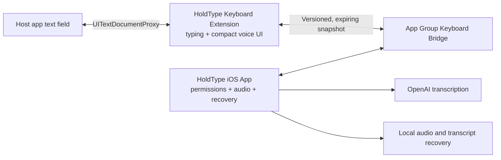

# HoldType iOS Keyboard Development Plan

Status: active feasibility work, started 2026-07-09.

The complete containing-app, settings, data, privacy, and macOS feature
portability roadmap lives in `docs/ios-product-portability-plan.md`. This file
keeps ownership of the keyboard-specific feasibility and typing milestones.
The P0-P8 order in that roadmap is canonical; milestone numbers here describe
keyboard dependency lanes, not a competing chronological implementation order.

## Decision

Build toward a familiar, full custom iPhone keyboard with a compact voice
action. Do not try to modify Apple's keyboard, record audio inside the keyboard
extension, or depend on a private automatic-return trick.

The expensive typing engine begins only after a physical-device spike proves
that the voice handoff and accepted-text insertion are reliable enough to be a
product.

## Product And Architecture

Target dependency rule:

- macOS app: existing domain and OpenAI pipeline;
- iOS containing app: portable domain/OpenAI code plus iOS audio and bridge;
- keyboard extension: keyboard UI, `UITextDocumentProxy`, and bridge only;
- no OpenAI, Keychain, raw audio, or microphone code linked into the extension.

The long-term code boundaries are `HoldTypeDomain`, `HoldTypeOpenAI`, and
`HoldTypeKeyboardBridge`. The feasibility spike starts with an isolated bridge
folder so it does not prematurely reorganize the stable macOS target.

## Milestone 0 — Platform Feasibility

### M0A: buildable extension and insertion bridge

- embed a minimal keyboard extension in `HoldType-iOS`;
- provide a normal character key and next-keyboard control;
- publish a harmless sample transcript from the containing app;
- load the sample from the App Group and insert it through
  `UITextDocumentProxy`;
- unit-test normalization, expiry, schema compatibility, and atomic round trip;
- verify the app bundle contains the `.appex` and the processed extension plist
  declares `com.apple.keyboard-service`.

No mic, network, background mode, Keychain sharing, or app-launch behavior is
part of M0A.

### M0B: physical keyboard constraints

Test on current iPhone and iPad hardware:

- select the same operator-local Apple Developer Team for the app and extension,
  register both App IDs and `group.app.holdtype.HoldType.shared`, and regenerate
  provisioning profiles; no team identifier is committed to the repository;
- keyboard enable/disable and next-keyboard behavior;
- App Group read with Full Access off;
- explicit `UITextDocumentProxy` Insert from that read-only path with Full
  Access off; keyboard-level Copy is not part of this promise;
- a separately justified debug matrix with Full Access on/off before enabling
  extension writes;
- secure, phone, email, multiline, and host-opt-out fields;
- portrait, landscape, docked, and floating layouts;
- keyboard process eviction and stale/expired snapshots.

### M0C: voice-session handoff

Validate one selected public-API product hypothesis:

1. The user explicitly activates a five-minute Quick Session in HoldType.
2. The user manually returns to the host and reselects HoldType with Globe when
   iOS leaves Apple's keyboard active.
3. The containing app keeps the microphone/audio engine visibly active for the
   bounded session. While armed but not `listening`, it discards incoming samples
   immediately and never persists or uploads them.
4. With disclosed Full Access, the keyboard sends only the phase-valid named
   voice-action and insertion-acknowledgement commands while that session is
   active, plus the content-free readiness heartbeat defined by the shared-state
   spec.
5. Expiry, Stop, interruption, app termination, and force quit close the session
   and microphone deterministically.
6. With Full Access off, the extension remains a working keyboard and read-only
   transcript insertion surface; manual app recording remains available.
7. When HoldType voice is inactive, use a system Dictation control if iOS shows
   one, otherwise Globe to Apple's keyboard and start Dictation there.
8. If keyboard-level Copy is proposed, validate explicit `UIPasteboard` use
   separately with Full Access; otherwise keep Copy in the containing app.

The keyboard never launches the containing app or relies on an automatic return
API. One-shot app recording is the safe fallback, not a competing default flow.

`UIBackgroundModes=audio` may be added only to the isolated M0C build after the
foreground app-only slice is complete. It supports only a foreground-started
Quick Session, never network/extension lifetime. If M0C fails, remove it from
the release target.

Every completed recording is stored locally before provider work. Automatic
insertion is disabled if the current `documentIdentifier` does not match the
session target.

### M0 go/no-go gate

Use at least Notes, Messages, Mail, Safari, and two third-party apps. The gate
passes only when repeated short sessions show:

- no lost completed recording;
- no silent insertion into the wrong field;
- no duplicate insertion from late results;
- deterministic Stop, timeout, interruption, and force-quit microphone shutdown;
- after Start, the complete path back to a HoldType-ready host field takes at
  most two explained actions: return and optional Globe re-selection;
- ordinary keyboard fallback remains available throughout.

If this gate fails, stop before full QWERTY and evaluate a companion app plus
Shortcut/App Intent workflow.

## Milestone 1 — Portable Core Extraction

- begin with only `AcceptedTranscript` in `HoldTypeDomain`, keeping the old
  macOS path as a compatibility facade and excluding the obsolete M0A
  open-containing-app session prototype;
- extract platform-neutral accepted-text, transcription configuration,
  post-processing, and error contracts;
- extract the Foundation-only OpenAI request pipeline without changing macOS
  behavior;
- introduce the versioned keyboard bridge as an explicit module or framework;
- keep all current macOS tests green;
- add real cancellation and mobile-safe file-backed upload before long audio is
  supported.

## Milestone 2 — iOS Containing App Vertical Slice

This lane maps to P3-P5 of the canonical portability roadmap and remains
foreground-only until P6/M0C passes.

- explain the platform/manual-return limit;
- add and enable HoldType Keyboard;
- explain ordinary typing and the M0B-proven read-only insertion mode without
  requesting Full Access yet;
- configure the user's BYOK API key and request microphone permission;
- choose the implemented typing layout and dictation language;
- run a guided real dictation and recovery example;
- teach Globe re-selection, system emoji, Space cursor movement, and conditional
  Apple Dictation fallback;
- microphone permission and `AVAudioSession` lifecycle;
- record, stop, transcribe, normalize, and retain recoverable audio;
- publish accepted text to the bridge;
- bounded timeouts, cancellation, interruptions, route changes, and offline
  recovery.

This milestone must not expose Quick Session, request Full Access for commands,
or declare an audio background mode. The fixed five-minute Quick Session is the
later P6/M0C hypothesis.

## Milestone 3 — iPhone Typing Foundation

Only after M0 passes:

- QWERTY, numbers, symbols, Shift/Caps Lock, Delete repeat, Space, Return, Globe;
- auto-capitalization, double-space period, callouts, hit slop, and haptics;
- local autocorrection, predictions while voice is idle, and correction Undo;
- field traits, portrait/landscape, small/standard/Max iPhones, light/dark mode;
- Space cursor trackpad and system emoji switching;
- VoiceOver and Reduce Motion;
- a compact action bar reserved for mic and voice status.
- set `hasDictationKey = true` only when that production voice key ships, then
  verify on physical iPhone/iPad that iOS does not add a duplicate Dictation
  key; the Phase 0 spike remains false.

M3 entry gate: approve the first-release typing layouts and dictionaries,
dictation languages, auto-detect policy, and the relationship between keyboard
locale and dictation language. The Phase 0 `en-US` metadata is not that decision.

Evaluate KeyboardKit separately before this milestone. It can shorten layout,
locale, and autocomplete work, but introduces a closed-source binary/pro
license, startup/memory, and vendor risk. The platform handoff must not depend
on a library-specific app-opening workaround.

Typing gate: the keyboard must be usable as the primary keyboard for a normal
working day without recurring blocker failures in tap accuracy, Space, Delete,
Return, Globe, cursor movement, or common field types.
Routine autocorrection and predictions must reduce repair work rather than make
users switch back to Apple's keyboard.

## Milestone 4 — Voice UX And Hardening

- dedicated mic in the compact action bar;
- `needsActivation`, `ready`, `listening`, `processing`,
  `confirmedInserted`, `deliveryUnverified`, `recoverableFailure`, and
  `interrupted` states;
- literal plus punctuation by default; AI polish is explicit;
- Retry/Insert where eligible plus instructions to use containing-app Latest
  Result or History for Copy; keyboard-level Copy appears only after its
  separate Full Access/`UIPasteboard` physical-device gate;
- durable extension-local pre-insert claims so missing acknowledgements or
  process restart cannot replay an insertion;
- repeated start/stop/process cycles, network changes, device lock, calls, Siri,
  AirPods changes, Low Power Mode, and app switching;
- TestFlight dogfood, privacy manifests, App Privacy disclosure, and App Review
  checklist.

## Milestone 5 — iPad Product

Begin after the iPhone gates pass:

- docked and floating keyboard layouts;
- landscape-first geometry and Stage Manager/multi-window safety;
- Magic Keyboard and Bluetooth-keyboard workflow;
- App Intent/Shortcut as a secondary voice trigger when the onscreen keyboard is
  hidden;
- explicit protection against insertion into the wrong window.

Do not market full iPad support until the hardware-keyboard path is usable in no
more than two clear actions.

## Verification Matrix

- Pure models and bridge: Swift unit tests with temporary local storage.
- Target composition: iOS simulator build/test with signing disabled.
- Extension embedding: inspect built app bundle and processed plist.
- Visual/layout smoke: iPhone and iPad simulators after a host harness exists.
- Full Access, secure fields, keyboard switching, lifecycle, app return, audio,
  and process eviction: physical devices only.
- OpenAI: fake-backed tests by default; no live provider call in normal tests.

Each completed physical-device pass belongs in `docs/qa/runs/` with OS/device,
host app, state, expected result, actual result, and go/no-go decision.

## Research Basis

- Apple custom keyboards:
  `https://developer.apple.com/documentation/uikit/creating-a-custom-keyboard`
- Apple Open Access:
  `https://developer.apple.com/documentation/uikit/configuring-open-access-for-a-custom-keyboard`
- Apple App Review Guidelines:
  `https://developer.apple.com/app-store/review/guidelines/`
- Apple DTS round-trip limitation:
  `https://developer.apple.com/forums/thread/826851`
- Apple Dictation and Space cursor gesture:
  `https://support.apple.com/guide/iphone/dictate-text-iph2c0651d2/ios`
  `https://support.apple.com/guide/iphone/type-with-the-onscreen-keyboard-iph3c50f96e/ios`
- Wispr Flow setup and iOS 26.4 handoff:
  `https://docs.wisprflow.ai/articles/7453988911-set-up-the-flow-keyboard-on-iphone`
  `https://docs.wisprflow.ai/articles/6269634092-adapting-to-ios-26-4`
- Willow app activation/background-session behavior:
  `https://help.willowvoice.com/en/articles/12855752-why-am-i-taken-back-to-the-willow-ios-app-before-i-can-dictate`

## Current Progress

- Research and architecture decision: complete.
- Product specs: complete for the feasibility, experience, and shared-state
  boundaries plus containing app, settings, voice/audio, history/storage,
  privacy, diagnostics, keyboard settings, output, and usage. Later
  language/layout details remain explicit entry gates.
- M0A source, target embedding, bridge tests, bundle inspection, and containing-
  app simulator smoke: complete.
- M0A real keyboard enablement, `UITextDocumentProxy` insertion, and Globe
  interaction: pending the first physical-device/manual pass and operator-local
  Apple Developer Team/App Group provisioning.
- M0B/M0C physical-device evidence: pending.
- P1 portable-domain extraction: active; `AcceptedTranscript` and
  `TranscriptionPromptContext` plus transcription language/validation and
  `TranscriptionConfiguration` plus custom-dictionary normalization package
  slices, `TextReplacementRule`, and emoji command models/catalog are complete;
  the next slice adds `EmojiCommandsConfiguration`.
- Full QWERTY and background Quick Session: gated and not started.
