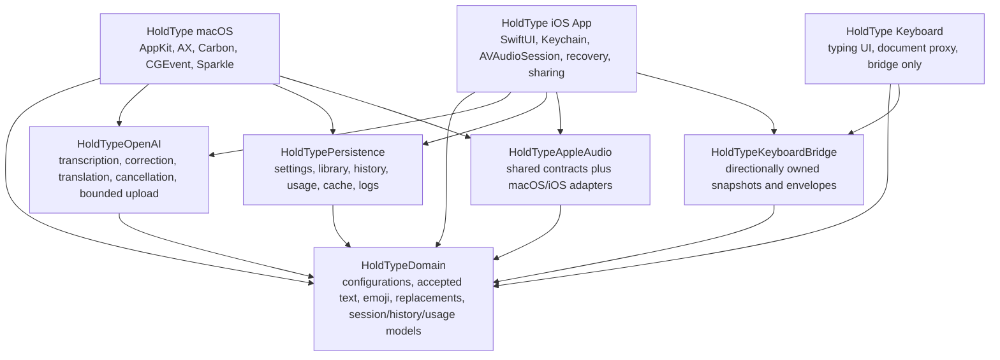

# HoldType iOS Full Product Portability Plan

Status: active implementation roadmap, P0 contracts and the first nine P1
Domain slices complete; updated 2026-07-09.

This document plans the complete iPhone and iPad companion product around the
HoldType keyboard. It does not authorize Swift, target, entitlement, or
background-mode changes by itself. User-visible behavior must be settled in
feature specs before implementation.

The keyboard feasibility lane and its physical-device gate remain defined in
`docs/ios-keyboard-development-plan.md`.

## Outcome

HoldType should become a native iOS product with three deliberately separate
surfaces:

1. The containing app owns setup, settings, secrets, microphone access, audio,
   OpenAI work, history, recovery, storage, usage, and diagnostics.
2. The keyboard extension owns ordinary typing, a compact voice action bar,
   safe accepted-text insertion through `UITextDocumentProxy`, and no secrets.
3. The system Settings app owns actual system controls such as microphone
   permission, keyboard enablement, and Full Access.

Most of the useful macOS behavior can move to iOS. The implementation must not
port the macOS window, global-hotkey, Accessibility, clipboard, Finder, Sparkle,
or floating-panel mechanisms. It should preserve the product intent through
iOS-native replacements.

The containing app can advance before the full keyboard gate. The production
QWERTY engine remains blocked until M0B/M0C physical-device evidence passes.

## Product Principles

- Native does not mean putting every preference in Apple's Settings app. Core
  HoldType configuration belongs in a SwiftUI app interface.
- The app is the source of truth. The keyboard receives only small, versioned,
  purpose-specific snapshots.
- The OpenAI API key stays in the containing app's Keychain. It is never copied
  into the keyboard extension or App Group.
- Ordinary keyboard input must work offline and without Full Access.
- Full Access is requested only for an explained, bidirectional voice-session
  bridge after the physical-device gate proves that bridge worthwhile.
- A completed recording becomes recoverable before provider work begins.
- Background microphone use is explicit, visible, bounded, and stoppable.
- Long press on Space remains cursor movement. Voice gets a dedicated action.
- iPad is a product adaptation, not a stretched iPhone screen.
- macOS behavior stays stable while portable layers are extracted.

## Native iOS Information Architecture

The main product should not be one enormous Settings form. Frequently used
actions and user-managed content need first-class destinations.

### iPhone

Use four top-level destinations, each with its own `NavigationStack`:

| Destination | Responsibility |
| --- | --- |
| Voice | Setup progress, Quick Session, visible timer, Start/Stop, current state, latest result, and practice field |
| Library | Dictionary, built-in and custom voice emoji commands, and ordered replacement rules |
| History | Accepted results, failed attempts, retry, playback, copy, share, and local deletion |
| Settings | Keyboard, transcription, correction, translation, voice behavior, provider, storage, usage, privacy, diagnostics, and About |

Setup may temporarily lead the first launch, but it must resolve into these
normal product destinations instead of remaining a permanent wizard.

### iPad

Use a `NavigationSplitView` with the same destinations in a sidebar and a
purpose-built detail column. It must support compact and regular widths, Split
View, Stage Manager, pointer input, hardware keyboards, and state restoration.
The onscreen keyboard's docked and floating layouts remain a separate keyboard
milestone.

### Settings hierarchy

| Section | Controls and destinations |
| --- | --- |
| Setup | Keyboard setup, last verified extension state, Full Access explanation, microphone status, OpenAI readiness, guided test |
| Keyboard | Typing layout, autocorrection, predictions, haptics, sound feedback, Space cursor help, Globe/system emoji help |
| Transcription | Model, dictation language, custom language code, transcription prompt |
| Writing & Correction | Local typography cleanup, AI correction, correction model, correction prompt, reset |
| Translation | Show Translate voice action, source behavior, target language, model, prompt, reset |
| Voice & Recording | Per-utterance limit, fixed Quick Session duration explanation, recording tail, cues/haptics, interruption behavior explanation |
| OpenAI | BYOK API key, autosave status, replace/remove, provider disclosure |
| Storage & Recovery | Recording retention including keep-last-N/unlimited, item count/size, playback, Share/Save to Files, history policy, clear actions |
| Usage | Local transcription usage estimate, today, 30 days, projection, chart, reset |
| Privacy & Permissions | What leaves the device, microphone, keyboard and Full Access disclosures, Open System Settings |
| Diagnostics | Redacted recent events, bridge status, export diagnostic bundle |
| About | Version, build, privacy policy, support, project links |

Dictionary, emoji commands, replacement rules, history, and recordings are
content editors, not simple toggles. They belong in searchable lists with
detail editors, empty states, validation, and explicit destructive actions.

Use standard SwiftUI `Form`, `List`, `Section`, `Picker`, `Toggle`,
`LabeledContent`, `SecureField`, confirmation dialogs, share sheets, and system
file exporters. Avoid recreating the macOS `SettingsView` or its AppKit text
controls.

### System Settings boundary

Do not add a `Settings.bundle` in the first complete iOS product. Apple
positions it for static, infrequently changed defaults. It cannot provide the
dynamic status, Keychain editing, searchable lists, history, diagnostics, and
onboarding HoldType needs.

The app should provide public, version-gated routes to its system settings and
the Default Apps settings where available, plus written fallback instructions.
It must not use private `prefs:` URLs or claim it can enable the keyboard
programmatically.

Keyboard readiness is evidence-based rather than a misleading binary check:

- provide an Open Keyboard Settings action;
- provide a practice field;
- after extension writes are justified, record its last successful heartbeat;
- show `Full Access: recently verified enabled` or `not currently verified`
  from the last fresh state published by the extension.

The containing app cannot reliably prove `Full Access: disabled`: once Full
Access is off, the extension cannot update the shared container and a previous
enabled heartbeat merely becomes stale. The extension itself may show its live
`hasFullAccess` state. The app may also offer a user-confirmed setup check, but
must not present that as system verification.

## Complete Feature Portability Matrix

Disposition meanings:

- **Reuse**: preserve the product contract and extract shared code.
- **Adapt**: preserve the intent with an iOS UI or platform adapter.
- **Replace**: use a different iOS interaction or system mechanism.
- **Defer**: keep out of the first complete iOS release until a new contract is
  approved.
- **Drop**: the macOS feature has no useful iOS product equivalent.

| macOS capability | iOS destination | Disposition | Required change |
| --- | --- | --- | --- |
| OpenAI BYOK API key | Setup and OpenAI | Adapt | iOS Keychain in containing app only; preserve autosave after non-empty entry or explicit paste, plus replace/remove |
| Transcription model | Transcription | Reuse | Shared validation and default `gpt-4o-transcribe`; native picker/advanced field |
| Dictation language, Auto, Custom | Transcription | Reuse | Keep separate from keyboard typing layout |
| Freeform transcription prompt | Transcription | Reuse | App-only sensitive content; never default-log or publish to extension |
| Custom dictionary | Library | Reuse | Preserve trim, case-insensitive dedupe, and first spelling; add search/import/export later only by spec |
| Built-in voice emoji sets | Library | Reuse | Preserve English, Russian, Spanish, German, French, and Portuguese sets |
| Custom emoji commands | Library | Reuse | Native editor; custom rules continue to take priority |
| Local typography cleanup | Writing & Correction | Reuse | Foundation-only pipeline, default on |
| Ordered literal replacements | Library | Reuse | Native list/editor; preserve literal, case-insensitive, non-regex behavior |
| OpenAI correction | Writing & Correction | Reuse | Default off, fail open, app owns request |
| Correction model and prompt | Writing & Correction | Reuse | Preserve presets/default prompt and explicit reset |
| Translation configuration | Translation | Reuse | Preserve source, target, model, prompt, validation |
| Option+Right Command translation trigger | Keyboard action bar | Replace | Explicit Normal/Translate voice action; no long-Space overload |
| Nearby active-text context | Future privacy feature | Defer | Current bridge forbids surrounding text; requires a separate opt-in contract using bounded document context |
| Microphone permission | Setup and Privacy | Adapt | Containing app only; request on first explicit voice action |
| Five-minute utterance maximum | Voice | Reuse | Preserve the independent per-recording limit and discard timeout artifacts |
| Five-minute armed Quick Session | Voice | Adapt | Separate background-session timer; fixed hypothesis until configurability is approved |
| Recording stop tail | Voice & Recording | Adapt | Preserve options after tap-to-stop semantics and interruption behavior are specified |
| Start/stop sounds | Voice & Recording | Adapt | Coordinate cues and haptics with silent mode and `AVAudioSession` |
| Global dictation hotkey | Keyboard voice action | Replace | Dedicated mic; App Intent/Shortcut may be secondary on iPad |
| Automatic active-app insertion | Keyboard extension | Replace | Conservative `UITextDocumentProxy` insertion only while the extension is active and a non-nil document/session/transcript identity still matches; otherwise explicit keyboard Insert or containing-app Copy; keyboard Copy remains separately gated |
| Keep Last Result | Voice and History | Adapt | Versioned latest/pending result with expiry; not process memory or hidden clipboard |
| Control+Command+V | Explicit keyboard Insert / containing-app Copy | Drop | No global paste shortcut on iOS |
| Explicit History row Copy | History | Adapt | Clipboard only after a clear user action; never as bridge transport |
| Floating indicator panel | Keyboard bar and Voice screen | Replace | Textual state, system mic indicator, optional Live Activity during active session |
| Launch at login | None | Drop | Voice Session begins only after explicit user action |
| Accepted transcript history | History | Adapt | Approved bounded durable local history because iOS process eviction is normal |
| Failed-attempt recovery | Voice and History | Adapt | Minimal pending-attempt journal plus approved durable failed rows and explicit retry after restart |
| History audio playback | History | Adapt | App-owned local playback while retained file exists |
| Recording cache | Storage & Recovery | Adapt | Private protected storage, backup exclusion, keep-last-N or explicit unlimited policy, playback/share/export |
| Reveal in Finder | Share/Save to Files | Replace | Use iOS share sheet, file exporter, and Quick Look where useful |
| Local OpenAI usage estimate | Usage | Reuse | Rename to Transcription Usage Estimate until text-token cost is specified |
| Correction/translation usage cost | Usage | Defer | Requires a separate token-estimate contract |
| Runtime diagnostic log | Diagnostics | Adapt | Bounded redacted logs and explicit export |
| macOS crash report browser | Diagnostics | Drop/replace | No browsing system crash files; consider MetricKit after a dedicated spec |
| Diagnostic bundle | Diagnostics | Adapt | Version/build/device/redacted settings/recent logs; no secrets or content |
| Sparkle update settings | About | Drop | App Store/TestFlight own updates; show version/build and optional store link |
| Accessibility permission | None | Drop | Keyboard inserts through public text document proxy |
| Input Monitoring permission | None | Drop | No global event tap |
| Menu bar shell | iOS app navigation | Replace | Distribute actions across Voice, History, Library, and Settings |
| System emoji keyboard | Globe route | Keep system route | Do not embed Apple emoji artwork |

The current repository contains model choices, not a reusable product-level
Mode/Profile entity. Do not invent a Modes feature as part of parity. If
profiles are desired later, they need their own product contract and migration
model.

## Settings Model And Persistence

### Split the current monolith

`AppSettings` currently mixes roughly thirty shared and macOS-only values. It
must not become the cross-platform public API. Extract these domain types:

- `TranscriptionConfiguration`;
- `TextProcessingConfiguration`;
- `TranslationConfiguration`;
- `PersonalizationConfiguration` for dictionary and emoji commands;
- `RetentionConfiguration` for history and recordings;
- `VoiceSessionPreferences`;
- `KeyboardPreferences`;
- `MacBehaviorConfiguration`;
- `IOSBehaviorConfiguration`.

Keep the existing `AppSettings` and its current UserDefaults keys as a macOS
facade during migration. Adapters convert between the facade and shared domain
types so extraction does not silently reset existing users' settings.

Rename platform-shaped semantics when they enter shared code:

- `translationShortcutEnabled` stays a macOS trigger preference; shared code
  separates translation action preference from `canRunTranslation`, and iOS
  presents an unavailable action with setup recovery until its target is valid;
- `automaticallyInsertTranscripts` becomes
  `insertAutomaticallyWhenCurrentTargetMatches` on iOS; a document identifier
  is a conservative guard, not proof of host-app or field identity;
- `saveTranscriptsToAppClipboard` becomes `keepLatestResult`; clipboard writes
  remain explicit actions;
- `showFloatingIndicator` stays macOS-only;
- `useActiveTextContext` stays off and unavailable on iOS until the separate
  privacy contract exists.

### Preserve the current product defaults deliberately

Extraction must not create accidental defaults. Start the iOS specs from this
audited macOS baseline, then document every intentional iOS difference:

| Setting | Current baseline | iOS direction |
| --- | --- | --- |
| Transcription model | `gpt-4o-transcribe` | Preserve |
| Dictation language | Auto | Preserve; separate from typing layout |
| Custom language code and prompt | Empty | Preserve |
| Dictionary | Empty | Preserve |
| Voice emoji | On, English set enabled | Preserve until localization entry gate |
| Nearby text context | Off | Keep unavailable in the first iOS release |
| AI correction | Off | Preserve |
| Correction model | Quality, currently `gpt-5.5` | Preserve with advanced custom option |
| Correction prompt | Standard conservative prompt | Preserve with Reset |
| Local typography cleanup | On | Preserve |
| Replacement rules | Empty | Preserve |
| Translation action preference | Enabled | Keep the action visible but unavailable with setup recovery until target configuration is valid |
| Translation source | Same as transcription | Preserve |
| Translation target | Unconfigured | Preserve; setup must make incomplete state clear |
| Translation model | `gpt-5.4-mini` | Preserve |
| Translation prompt | Standard translation prompt | Preserve with Reset |
| Automatic insertion | On | Adapt to target-safe keyboard insertion |
| Keep latest result | On | Adapt; no automatic system clipboard write |
| Sound cues | On | Adapt to iOS audio/haptic policy |
| Recording tail | Off | Preserve pending iOS interaction spec |
| Recovery history | On, session-only, up to 20 accepted entries | Use durable local iOS history: 20 accepted plus five failed entries |
| Recording cache | Off; supports keep last N or explicit unlimited, with 10 as the default N | Preserve intent with protected app storage and visible size/clear responsibility |
| Floating indicator | On | Remove setting; replace surface |
| Launch at login | Off | Remove on iOS |
| Automatic update checks/downloads | macOS/Sparkle settings | Remove on iOS |

### Data ownership

| Data | Canonical owner | Storage | Keyboard access |
| --- | --- | --- | --- |
| API key | Containing app | App-only Keychain with iOS accessibility policy | Never |
| Credential-presence marker | Containing app | Non-secret app-private status, excluded from backup | Never |
| Small preferences and models | Containing app settings repository | App defaults behind versioned migrations | Published subset only |
| Dictionary, emoji commands, replacements | Containing app library repository | Versioned app-private structured file, atomic writes, file protection | Optional compact read-only snapshot after spec |
| Usage events | Containing app | Bounded app-private persistence | Never |
| Pending provider attempt | Containing app | Minimal atomic app-private journal plus protected audio | Never |
| Latest/pending accepted output | Containing app | Protected versioned delivery record, 24-hour cap, excluded from backup | Bounded result snapshot only |
| Accepted and failed history | Containing app | Approved bounded durable app-private persistence | Never |
| Recoverable audio | Containing app | Protected app-private files, excluded from backup | Never |
| Keyboard preferences | Containing app | App Group immutable snapshot with schema/revision | Expected read-only path without Full Access, contingent on M0B; bundled minimal fallback required |
| Voice session status and accepted result | Containing app | Short-lived App Group snapshot with TTL | Read and insert |
| Voice commands, insertion acknowledgements, readiness heartbeat | Keyboard extension | Separate short-lived extension-owned envelopes | App reads after justified Full Access |
| Pre-insert claim ledger | Keyboard extension | Bounded content-free extension sandbox, 64 IDs/24 hours | Never; acknowledgement only reconciles app recovery |
| Runtime logs | Each executable | Bounded redacted local log | No cross-process content logging |

Do not use one read-modify-write App Group file for both processes. Before the
extension writes, split the bridge into directionally owned records:

- app-owned `VoiceSessionSnapshot`;
- app-owned `KeyboardPreferencesSnapshot`;
- extension-owned voice command envelopes;
- extension-owned insertion acknowledgements;
- extension-owned content-free readiness heartbeat.

Each runtime record needs a schema version, monotonic revision in its writer
domain, session/transcript identity where relevant, atomic replacement,
validation, bounded expiry, and owner-only cleanup at the writer's next
lifecycle opportunity. Static keyboard preferences are versioned but do not
expire. Raw audio, API keys, prompts, ordinary keystrokes, surrounding text,
provider payloads, and analytics remain forbidden.

A `UITextDocumentProxy` document identifier is an opportunistic safety guard,
not a reliable host-app or field identity. Automatic insertion is allowed only
while HoldType is the active extension and the same non-nil identifier is
observed for the session and result, together with matching session and
transcript IDs. Missing or changed identity always falls back to an explicit
keyboard Insert or containing-app Copy action; keyboard-level Copy remains
separately Full-Access/device gated. HoldType never attempts a private
automatic return.

User dictionary terms can be sensitive. If a future typing lexicon snapshot
needs them, the spec must name the exact fields, retention, logging rules, and
user disclosure. Do not publish the full app repository by convenience.

Apple documents read-only shared-container access without Full Access, but
HoldType still treats it as an M0B physical-device product gate. If that path
is not reliable across supported systems, the extension falls back to bundled
minimal typing preferences and asks the user to open HoldType for features that
need a refreshed snapshot.

### Durable history decision

The macOS product currently presents session-only recovery history even though
a separate persistent store exists. Session-only state is not robust on iOS,
where process eviction is routine.

The approved iOS contract is a local, bounded history that survives app
restart, capped initially at 20 accepted entries plus a small failed-attempt
queue. It must provide:

- clear first-use privacy copy and a setting that disables future history and
  immediately clears current accepted/failed entries and temporary retry
  audio, in line with the current privacy contract;
- individual delete and Clear All;
- relative recording identifiers rather than stale absolute URLs;
- atomic metadata saves and startup reconciliation with retained audio;
- file protection and backup exclusion;
- retry after relaunch without exposing content to the keyboard;
- no cloud sync in the first release.

The detailed behavior is governed by `ios-history-and-storage.md`. A minimal
pending-recording journal needed to prevent loss during an active provider
attempt remains a separate recovery invariant, not accepted transcript history.

## Source Portability Audit

### Extract into portable layers

| Area | Current owner | Plan |
| --- | --- | --- |
| Accepted text | `Models/AcceptedTranscript.swift` | Move unchanged with tests |
| Languages, validation, prompt composition | `Models/AppSettings.swift` | Split into domain configurations |
| Emoji catalog and custom commands | `Models/EmojiCommandSet.swift` | Move to domain |
| Emoji replacement | `Services/EmojiCommandReplacementService.swift` | Move to domain |
| Local cleanup and replacement pipeline | `Services/TranscriptTextCorrectionService.swift` | Move pure postprocessor to domain |
| OpenAI transcription | `OpenAITranscriptionRequestBuilder.swift`, `OpenAITranscriptionService.swift` | Move after mobile transport hardening |
| OpenAI correction and translation | `OpenAITextCorrectionService.swift`, `OpenAITextTranslationService.swift` | Move with real cancellation |
| Credential value | `Services/OpenAICredential.swift` | Move value/resolver contract; keep storage adapter platform-specific |
| Usage models/store | `Models/OpenAIUsageEstimate.swift`, `Services/OpenAIUsageStore.swift` | Move model; inject persistence and clock |
| History models | `Models/TranscriptHistoryEntry.swift`, `Services/TranscriptHistoryStore.swift` | Redesign before moving: current Codable drops audio URL and failed recovery is session-only/absolute-path/transcription-only |
| Runtime diagnostic formatting | `Services/RuntimeDiagnosticsLogStore.swift` | Do not move generic string metadata; replace with typed event/field allowlists and forbidden-value tests |
| Session orchestration | `Services/DictationSessionController.swift` | Extract only after output results, cache lifecycle, recovery destinations, and status presentation are platform-neutral |

The repository's test targets contain hundreds of tests, with a large relevant
subset around these areas. Preserve that subset as the behavioral safety net
of a local Swift package and run shared tests for both macOS and iOS
destinations.

### Fix before calling the OpenAI layer mobile-ready

The current services have two important hidden gaps:

1. `cancelActiveTranscription`, `cancelActiveCorrection`, and
   `cancelActiveTranslation` fall back to empty protocol implementations. The
   session may ignore a late result, but the HTTP task keeps running. The shared
   service must own cancellable request tasks and prove cancellation in tests.
2. Transcription builds the entire multipart audio body in memory with
   `Data(contentsOf:)`. Replace this with a bounded, file-backed upload path
   before long or background recordings are enabled.

Keep the existing explicit external timeouts. Add mobile-safe cancellation,
retry classification, offline behavior, and reuse of a completed local audio
artifact rather than re-recording.

The existing `Shared/KeyboardSessionState.swift` and its open-containing-app
actions are an M0A spike prototype, not the production session contract. They
conflict with the approved no-launch, already-active Quick Session bridge and
must not enter `HoldTypeDomain`. Replace them only inside the P6 bridge slice
after M0B/M0C gates. P1 began with the deliberately isolated
`AcceptedTranscript` move; subsequent completed slices keep the same
behavior-neutral, test-first boundary.

### Extract a platform-neutral context type

Completed 2026-07-09: `TranscriptionPromptContext` and its exact prompt
composition now live in `HoldTypeDomain`; the macOS typealias facade keeps AX
acquisition in `ActiveTextContextService.swift`, and shared/iOS tests cover the
public value.

This behavior-neutral move deliberately preserves the current macOS
`max(1, requestedCharacterCount)` suffix semantics and does not turn 1,000
Swift Characters into a hard privacy or byte boundary. The legacy AX adapter
may still receive a full field value before taking its suffix. Neither behavior
is approved for iOS reuse. Nearby Text Context remains unavailable on iOS until
a separate privacy contract defines a bounded source-range API, hard character
and UTF-8 byte caps, Unicode-safe truncation, and fail-closed behavior when the
host cannot provide a bounded range.

The current session controller is not portable merely because its recorder and
output are protocols. Its output result is shaped by macOS insertion, its cache
contract exposes Finder, its recovery presentation points to macOS Settings,
and its status model contains menu/hotkey presentation. Extract neutral
delivery results, a cache-lifecycle protocol without reveal actions,
platform-neutral recovery destinations, and session state separate from
platform presentation before moving the controller.

### Build iOS adapters instead of conditionalizing macOS code

| Responsibility | iOS adapter |
| --- | --- |
| Microphone permission | AVFoundation authorization status and public Settings route |
| Audio capture | `AVAudioSession` coordinator plus recorder/engine, interruptions, routes, lock/background lifecycle |
| Secret storage | Security framework with app-only access and explicit accessibility policy |
| Text output | App publishes result; extension validates target and calls `UITextDocumentProxy.insertText` |
| Recording storage | App-private FileManager repository with playback/share/export |
| Diagnostics | App-owned redacted logs and shareable bundle |
| Cues and playback | Audio-session-aware AVFoundation adapter |
| System settings | Public `UIApplication` settings URLs with availability fallback |
| Live session visibility | Voice screen, keyboard state, system mic indicator, optional Live Activity |

Do not carry these macOS implementations into the iOS target: CGEvent/Carbon
hotkeys, Accessibility/Input Monitoring, active-app insertion, AppKit
settings/pasteboard, floating `NSPanel`, launch-at-login, Finder reveal,
system crash-report browsing, or Sparkle.

## Target Architecture

Use a local Swift package or equivalent explicit modules instead of spreading
`#if os(...)` through the current macOS target.

Arrows below point from a dependent target to the module it imports.

Dependency invariants:

- `HoldTypeDomain` imports Foundation only.
- `HoldTypeOpenAI` receives credentials and configuration; it does not own
  Keychain or UI.
- platform persistence adapters implement shared repositories.
- the keyboard target links domain types needed for typing and the bridge, but
  not OpenAI, Keychain, raw-audio, history, or diagnostic bundle code.
- the containing app is the only provider client and canonical settings writer.
- the macOS app keeps compatibility adapters until extraction is complete.

## Voice Session And Background Audio

The iOS recorder can reuse the current artifact/status contracts and some
`AVAudioRecorder` code, but the current service does not manage
`AVAudioSession`, interruptions, route changes, Bluetooth/AirPods policy,
background execution, or protected files.

Create a dedicated iOS audio-session coordinator in two layers: foreground
recording in P4, then bounded background Quick Session behavior in P6A. Across
those layers it must own:

- category, mode, activation, and deactivation;
- microphone authorization transitions;
- interruption begin/end behavior for calls, Siri, alarms, and system events;
- route changes and input loss;
- device lock, scene backgrounding, app termination, and force quit behavior;
- five-minute expiry and immediate Stop;
- coordination between recording, cues, and history playback;
- deterministic cleanup on every failure path.

Two independent timers must remain separate in state, copy, settings, and QA:

- the per-utterance maximum limits one retained recording to five minutes;
- the armed Quick Session hypothesis keeps the containing app's bounded voice
  bridge available for five minutes.

Their current durations happen to match, but an utterance timeout produces a
recording failure while Quick Session expiry disarms the background session.
The first Quick Session implementation remains fixed-duration; exposing a
duration setting requires a later product decision.

The M0C hypothesis is still an explicit five-minute Quick Session started in
the foreground. While armed but not listening, incoming samples are discarded
immediately and never persisted or uploaded. A keyboard mic tap may start
retaining only the current utterance after the justified Full Access bridge is
proven.

Before the first Quick Session, obtain separate informed consent that its
microphone session remains active while armed, can continue in the background,
lasts for a fixed bounded period, uses battery, shows the system microphone
indicator, and ends through Stop or expiry. Provider consent does not replace
this microphone-session consent.

Stopping recording must not keep `AVAudioSession` or the microphone active just
to finish OpenAI work. The physical-device matrix must prove one supported
completion path: a bounded background task, a suitable background transfer, or
durable pending state that resumes provider work in the foreground. If none is
reliable, preserve the artifact and ask the user to reopen HoldType.

If used, a Live Activity is a visible status and Stop surface, not a background
execution mechanism. It must contain no transcript or other sensitive content
and end with the audio session. The app, keyboard state, system microphone
indicator, and accessibility announcements must still communicate state when
Live Activities are disabled.

## Privacy, Consent, And Security

Before the first provider request, explain and obtain explicit agreement that:

- recorded audio is sent to the user's configured OpenAI account for
  transcription;
- optional correction or translation may send transcribed text before the user
  finally accepts it and may create more than one provider request;
- HoldType stores the API key only in the device Keychain, never in the
  extension, App Group, or a HoldType server, and sends it directly to OpenAI
  over a protected connection to authenticate each request;
- ordinary keystrokes and surrounding host-field text are not sent;
- local history and recording retention follow the selected policy.

Release work must include:

- `NSMicrophoneUsageDescription` with product-specific language;
- privacy manifests for every executable bundle as required by used APIs;
- App Store privacy answers covering actual audio and user-content handling and
  the third-party provider;
- an Xcode privacy report and physical-device App Privacy Report check;
- no transcript, prompt, dictionary entry, API key, raw audio, or provider
  payload in default logs or diagnostics;
- no analytics or cloud sync added implicitly during the port.

Full Access copy must state what it enables, what it does not enable, the exact
bridge data, and what still works without it. Full Access is not microphone
permission.

## Accessibility And Localization

The containing app must support Dynamic Type, VoiceOver, Voice Control, Switch
Control, Full Keyboard Access, Dark Mode, Increase Contrast, and Reduce Motion.

Every nonstandard keyboard key needs a keyboard-key accessibility trait and a
state-specific label/value/hint. Ready, needs activation, listening,
processing, confirmed-inserted, delivery-unverified, recoverable failure, and
interrupted states must be communicated by text and accessibility announcements,
not color or waveform alone.

The typing fallback must remain usable for people who cannot or do not want to
speak. Dictation language and typing layout are separate settings. All first-
release layouts, localized strings, and VoiceOver phrasing are explicit entry
criteria for the production keyboard milestone.

## Development Roadmap

### P0 — Contracts and gates

- run M0B as soon as operator-local provisioning and physical devices are
  available; keep the existing M0C go/no-go criteria unchanged;
- maintain the approved iOS behavior specs listed below;
- preserve the approved iOS information architecture, durable-history policy,
  fixed Quick Session duration, privacy boundaries, and named typing gates;
- record baseline macOS tests and defaults before extraction.

Exit: complete. No user-visible iOS behavior depends only on this planning
document; baseline macOS and iOS tests passed before extraction.

P0 baseline recorded 2026-07-09: the macOS scheme test suite and the
`HoldType-iOS` iPhone simulator test suite both passed without live-provider or
physical-device claims. M0B/M0C remain operator-local physical gates.

### P1 — Portable domain extraction

- begin with the isolated `AcceptedTranscript` package move and compatibility
  facade before extracting broader configuration;
- create the local package/module boundaries;
- move accepted text, configurations, validation, emoji, dictionary
  normalization, local cleanup, replacement rules, and pure models;
- split `AppSettings` behind a compatibility facade;
- move `TranscriptionPromptContext` out of the AX file;
- define neutral delivery results, cache lifecycle, recovery destinations, and
  session state without macOS menu/hotkey presentation;
- move relevant unit tests without changing macOS behavior.

Exit: macOS builds/tests pass and shared tests run on macOS and iOS.

Progress 2026-07-09: local package `HoldTypeDomain` now owns the public
Foundation-only `AcceptedTranscript`, `TranscriptionPromptContext`,
`TranscriptionLanguage`, custom-language validation, and
`TranscriptionConfiguration`, plus the normalized `CustomDictionary` value.
The package also owns the Codable `TextReplacementRule` value without changing
its legacy JSON fields, and the four emoji-command values plus the exact
six-language built-in catalog. `EmojiCommandsConfiguration` now owns the pure
selection, normalization, enabled-state, and prompt-hint behavior, and the
exact emoji alias matcher is portable. The macOS app keeps source-compatible
typealias/presentation facades, projects the configuration from its existing
scalar settings, and preserves the UserDefaults keys, scalar raw values, and
custom-dictionary `[String]` storage. Direct package consumers are linked
explicitly, the keyboard remains unlinked, and package/macOS/iOS tests pass.

### P2 — Mobile-ready provider and persistence foundations

- extract OpenAI transcription, correction, and translation;
- implement real request cancellation and bounded file-backed upload;
- add iOS settings migrations, app-only Keychain adapter, and the non-secret
  last-known credential-presence marker with partial-failure reconciliation;
- add versioned library/usage/history repositories and protected recording
  storage;
- split the App Group bridge by writer direction.

Exit: fake-backed iOS tests prove save/load/migrate/cancel/expiry/recovery;
normal verification makes no live provider call.

### P3 — Native containing-app shell

- implement Voice, Library, History, and Settings navigation;
- implement setup status, public system-settings routes, practice field, and
  honest extension/Full Access verification;
- implement only settings and content editors already consumed by the P4
  app-only flow: provider, transcription, correction, translation, library,
  foreground recording, and baseline storage/privacy;
- add keyboard, Quick Session, durable-history, and production typing controls
  only in their owning milestones; do not ship saved settings that have no
  effect;
- support iPhone compact layout and iPad split layout from the start, without
  claiming production iPad keyboard support.

Exit: all P4-owned configuration is editable and restorable, future controls
are absent rather than inert, and no voice provider flow is required yet.

### P4 — App-only voice vertical slice

- request microphone permission after an explicit action;
- add a foreground `AVAudioSession` coordinator with activation,
  deactivation, interruption, and route handling;
- record one utterance, finish a protected artifact, transcribe, run local
  processing, optionally correct/translate, and publish an accepted result;
- atomically persist a minimal `PendingRecording` journal before the first
  provider request so force quit or eviction cannot orphan a completed
  recording;
- add bounded timeouts, real cancellation, offline behavior, retry, and
  actions inside HoldType's practice/editor field plus explicit copy/share;
  this milestone cannot insert into a previously active external app;
- add clear provider consent before the first request.
- keep this milestone foreground-only: the processed app must not contain an
  audio background mode or expose Quick Session.

Exit: a recoverable app-only dictation works without Full Access or keyboard
commands.

### P5 — Recovery, storage, usage, and diagnostics

- add the approved durable accepted and failed history while preserving the
  independent pending-recording journal;
- reconcile the independent pending-recording journal after relaunch and allow
  retry of that interrupted active attempt and any approved durable failed row;
- add playback, Share/Save to Files, retention and clear flows;
- add transcription usage estimate and typed-allowlist diagnostic export;
- verify privacy manifests and default-log redaction.

Exit: force quit, process eviction, network loss, and provider errors do not
lose a completed recording silently.

### P6 — M0C Quick Session spike and production bridge

Entry: M0B has passed on physical devices; Full Access and Quick Session
consent copy is approved. The user has not yet been asked to trust a production
background session.

#### P6A — Minimal M0C spike

- extend the foreground audio coordinator with the smallest bounded background
  lifecycle needed by the existing M0C hypothesis;
- add `UIBackgroundModes=audio` only in the isolated M0C configuration and
  remove it from the release target if the gate fails;
- add one minimal extension-owned voice command and one insertion
  acknowledgement record, carrying the source document identifier from the
  explicit start command into the matching app-owned result;
- add the content-free five-minute readiness heartbeat for truthful Full Access
  status;
- show explicit armed/listening/processing/expired state and immediate Stop;
- prove a supported post-recording provider path without keeping the microphone
  active merely for network work;
- validate the existing M0C matrix on physical devices.

Gate: if M0C fails, stop background-session and bidirectional-bridge work. Keep
manual one-shot recording and the read-only insertion fallback; do not begin
production hardening or full QWERTY.

#### P6B — Production hardening after M0C passes

- complete the bounded background lifecycle and optional Live Activity;
- harden extension command envelopes and insertion acknowledgements;
- add the bounded extension-local pre-insert claim ledger before any
  `insertText` call so missing acknowledgements and process restart cannot
  replay a transcript;
- add Normal/Translate action intent before provider work starts;
- enforce conservative active-extension, non-nil document, session, and
  transcript matching plus idempotent insertion;
- keep explicit Insert plus containing-app Copy and manual one-shot recording
  as safe fallbacks; keyboard-level Copy remains separately gated.

Exit: repeated real-device sessions show deterministic Stop/expiry,
interruption safety, supported network completion/resume, no wrong-field
insertion, and no duplicate insertion.

### P7 — Production iPhone keyboard

Entry: the existing keyboard M0 gate and typing-layout entry criteria pass.

- implement full QWERTY/numbers/symbols, Shift/Caps, Delete repeat, Space,
  Return, Globe, field traits, callouts, hit slop, and haptics;
- implement local autocapitalization, autocorrection, predictions, Undo, and
  Space cursor trackpad;
- add the compact voice action bar without weakening ordinary typing;
- switch `hasDictationKey` from the Phase 0 false value to true when the
  production dedicated voice key ships, then verify no duplicate system
  Dictation key on physical iPhone/iPad hardware;
- complete accessibility, rotation, small/standard/Max phone, light/dark, low
  memory, secure-field, and host-opt-out testing.

Exit: HoldType is usable as the primary keyboard for a normal working day.

### P8 — iPad and release hardening

- complete docked/floating keyboard layouts and Stage Manager safety;
- add hardware-keyboard workflow and evaluate App Intent/Shortcut as a
  secondary trigger;
- prevent wrong-window insertion in multiwindow use;
- run TestFlight dogfood, App Review, privacy, battery, performance, and memory
  gates.

Exit: iPad is marketed only when both onscreen and hardware-keyboard paths are
honest and usable.

## P0 Behavior Specs

These approved contracts govern their owning milestones and must be updated
before observable behavior changes:

1. `ios-containing-app-experience.md` — navigation, setup, Voice surface, and
   practice flow.
2. `ios-settings-and-secret-storage.md` — settings schema, defaults,
   migrations, Keychain, and app/system Settings boundary.
3. `ios-voice-session-and-audio.md` — one-shot and Quick Session lifecycle,
   background audio, interruptions, routes, expiry, and visibility.
4. `ios-history-and-storage.md` — approved durable history, recording
   protection, retention, deletion, retry, share, and reconciliation.
5. `ios-privacy-and-permissions.md` — microphone, Full Access, provider consent,
   manifests, disclosures, and logs.
6. `ios-diagnostics.md` — redaction, export bundle, and any future MetricKit
   scope.
7. `ios-keyboard-settings-snapshot.md` — exact non-secret preferences and
   optional lexicon fields visible to the extension.
8. `ios-output-actions.md` — latest result, Copy, Share, insertion identity,
   acknowledgements, and failure recovery.
9. `ios-usage-estimate.md` — successful-transcription usage events, 30-day
   summary/chart, pricing gaps, retention, and Reset isolation.

Update `ios-keyboard-shared-state.md` before the extension becomes a writer.
Update `ios-keyboard-experience.md` before Normal/Translate actions, recovery
actions, or production typing settings are implemented.

## Verification Strategy

| Layer | Verification |
| --- | --- |
| Domain/configuration | Unit tests on macOS and iOS destinations, migration fixtures, default parity |
| OpenAI | Fake URL loading, timeout and cancellation tests, file-backed upload tests, no live calls by default |
| Persistence | Atomic write, corrupt data, migration, file protection configuration, eviction/relaunch reconciliation |
| Containing app | SwiftUI state/navigation tests plus simulator UI smoke |
| Audio | Injectable fakes, bounded timeout tests, physical interruption/route/lock/background matrix |
| Bridge | Schema, TTL, ownership, concurrent writer isolation, duplicate/late ack tests |
| Keyboard | Simulator composition; physical device for Full Access, secure fields, host opt-out, switching, eviction |
| Accessibility | Accessibility Inspector plus manual VoiceOver, Voice Control, Switch Control, Full Keyboard Access |
| Privacy | Xcode privacy report, App Privacy Report, log/bundle redaction fixtures |
| Release | TestFlight on current iPhone/iPad hardware, memory, battery, network, Low Power Mode, App Review checklist |

Every physical pass belongs in `docs/qa/runs/` with device, OS, host app,
permission state, Full Access state, expected result, actual result, and gate
decision.

## Decisions Deferred To Named Gates

These decisions do not block earlier independent work:

- choose first-release typing layouts and dictionaries;
- evaluate Live Activity only after the basic M0C audio path passes;
- decide whether correction/translation usage estimates are worth a separate
  token-cost feature;
- decide the secondary hardware-keyboard trigger for iPad;
- keep profiles/modes outside parity unless a later product contract adds them.

Durable local history, a fixed five-minute Quick Session, and exclusion of
dictionary/emoji/replacement content from the v1 keyboard settings snapshot are
already decided by their P0 specs.

## Recommended Next Slice

Do not begin by porting `SettingsView` or adding every macOS source file to the
iOS target. P0 plus the accepted-text, prompt-context, language,
transcription-configuration, custom-dictionary, text-replacement, emoji
model/catalog, and emoji-configuration slices are complete. The next P1 slice
and emoji-matcher slices are complete. The next P1 slice moves the complete
local transcript post-processing pipeline:

1. define a pure post-processing configuration for cleanup, emoji commands, and
   ordered text-replacement rules;
2. extract informal typography normalization, cleanup → emoji → replacement
   ordering, and accepted-text fallback into Domain;
3. keep the existing `AppSettings`-accepting call shape through a macOS adapter
   while adding package and iOS tests for the pure API;
4. preserve case-insensitive literal replacement, rule order, empty-output
   fallback, and the exact macOS defaults;
5. keep UI, App Group publication, provider work, audio, background modes, the
   obsolete M0A session prototype, and the production QWERTY engine outside
   this slice.

## Research Basis

Official Apple material reviewed 2026-07-09:

- SwiftUI Form:
  `https://developer.apple.com/documentation/swiftui/form`
- NavigationStack and NavigationSplitView:
  `https://developer.apple.com/documentation/swiftui/navigationstack`
  `https://developer.apple.com/documentation/swiftui/navigationsplitview`
- Settings bundle:
  `https://developer.apple.com/documentation/foundation/building-a-settings-bundle-for-your-app`
- Custom keyboard and Open Access:
  `https://developer.apple.com/documentation/uikit/creating-a-custom-keyboard`
  `https://developer.apple.com/documentation/uikit/configuring-open-access-for-a-custom-keyboard`
- App Groups and Keychain sharing:
  `https://developer.apple.com/documentation/bundleresources/entitlements/com.apple.security.application-groups`
  `https://developer.apple.com/documentation/security/sharing-access-to-keychain-items-among-a-collection-of-apps`
- AVAudioSession and background recording:
  `https://developer.apple.com/documentation/avfaudio/avaudiosession`
  `https://developer.apple.com/documentation/avfaudio/avaudiosession/category-swift.struct/record`
- App privacy details and review guidelines:
  `https://developer.apple.com/app-store/app-privacy-details/`
  `https://developer.apple.com/app-store/review/guidelines/`

## Plan Completion Criteria

This portability plan is complete when it continues to provide one traceable
place for:

- every current macOS product feature and its iOS disposition;
- every new iOS-only system responsibility;
- the settings and data owner for each value;
- platform-specific exclusions and privacy invariants;
- source extraction boundaries and prerequisites;
- milestone entry and exit gates;
- unresolved decisions that need an explicit product choice.

Implementation progress should update the roadmap and the relevant feature
specs together. A checked roadmap item never overrides a failed physical-device,
privacy, typing-quality, or App Review gate.
