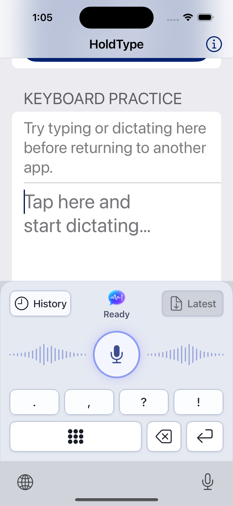

# iOS Brand Stage Keyboard QA

Date: 2026-07-13; restricted-access correction verified 2026-07-14

Scope: production Brand Stage composition, concise status contract, Latest-only
shared cache, and containing-app History route.

## Result

The keyboard matches the approved Option 2 hierarchy in iPhone and iPad Light
and Dark appearances. It contains only controls and state: no transcript,
History row, card, preview, or QWERTY layout is rendered inside the extension.

The centered label is intentionally limited to:

- `Ready` when the local keyboard controls are usable;
- `Open failed` briefly after an unsuccessful History request.

It does not show action narration such as `Latest ready`, `Inserted`, or
`Opening History`. Latest availability is represented by the Latest button.

## Visual Evidence

Approved source:

| Device | Light | Dark |
| --- | --- | --- |
| iPhone 16, iOS 18.6 | [Screenshot](assets/ios-brand-stage-keyboard-2026-07-13/iphone-light.png) | [Screenshot](assets/ios-brand-stage-keyboard-2026-07-13/iphone-dark.png) |
| iPad Pro 11-inch, iOS 26.0 | [Screenshot](assets/ios-brand-stage-keyboard-2026-07-13/ipad-light.png) | [Screenshot](assets/ios-brand-stage-keyboard-2026-07-13/ipad-dark.png) |

The iPhone and iPad captures were refreshed from the real extension on
2026-07-14 and show the current `Ready` contract in both appearances. The
captures verify:

- equal History and Latest geometry;
- a centered transparent HoldType mark with no square background;
- one-line compact status text;
- distinct keyboard and host-app surfaces;
- unchanged hierarchy and geometry between appearances;
- bounded iPad content width instead of stretched controls.

The current real extension was also captured with Accessibility Large text and
Increase Contrast enabled:

`History` and `Latest` expand to preserve their complete labels, editing symbols
remain bounded, and all editing controls retain at least 44-point targets.

## History Route Evidence

The containing app registers the strict `holdtype://history` route. Opening it
with `simctl openurl` selected the real History destination:

This proves app-side route registration and navigation only. A real History tap
from the keyboard called public `NSExtensionContext.open`; iOS 18.6 Simulator
returned `false`, and the keyboard displayed the required compact failure:

No private responder-chain or `UIApplication` workaround is present. Direct
keyboard-to-app launch therefore remains a signed-device and review gate rather
than a release claim. [Apple App Review Guideline 4.4.1](https://developer.apple.com/app-store/review/guidelines/)
also says keyboard extensions must not launch apps other than Settings.

## Shared Cache Boundary

- The snapshot contains schema/revision metadata and at most one Latest item.
- Production publication is enabled. The containing app is the only writer and
  the keyboard is read-only.
- `RequestsOpenAccess` is false. Apple documents read-only access to the
  containing app's shared containers in the restricted keyboard sandbox, so
  Latest is not gated by `hasFullAccess` and HoldType requests no Full Access.
- An already-expired Latest result is omitted instead of copying its text into
  App Group storage.
- An open keyboard disables Latest when the published item reaches its
  10-minute expiry; it does not wait for another lifecycle event.
- If the current canonical Latest is unsafe to project, the app writes an empty
  schema 3 snapshot instead of leaving older text presented as current. A
  canonical-load failure preserves the bounded last-known cache until expiry.
- App startup atomically replaces legacy schema 1/2 payloads with an empty
  schema 3 snapshot.
- History, recent-result arrays, settings, prompts, audio, provider payloads,
  and credentials never enter this snapshot.

## Automated Evidence

- Full `HoldType-iOS` iPhone Simulator test run: 1,023 passed, 0 failed,
  0 skipped.
- The full run includes eight direct UIKit tests of the actual Brand Stage
  view: control composition and callbacks, 44-point portrait geometry,
  adaptive top-action sizing, bounded symbols, conditional Globe, and compact
  landscape matrices at 667, 812, 844, 852, and 932 points in Light and Dark.
  The compact matrix keeps the brand, status, and 80-point voice stage visible,
  verifies the two-column order, and rejects ambiguity or out-of-bounds
  controls. It also covers horizontal and bottom safe-area insets and a
  compact-regular-compact trait round trip. The real accessibility screenshot
  verifies that the resulting large text is not clipped.
- Eight controller-level tests exercise the actual callback wiring: Latest never
  inserts on load, each valid tap inserts once, expiry disables insertion,
  stale expiry cannot clear a replacement, editing and cursor actions reach the
  document proxy, Return and Globe follow host traits, and synchronous or
  asynchronous History failure shows only `Open failed` before returning to
  `Ready`.
- Focused publisher and command-surface run: 12 passed, 0 failed. Focused real
  keyboard-view and controller run: 16 passed, 0 failed.
- `HoldType-iOS` generic Simulator Release build: passed.
- `HoldType` macOS build: passed.
- `git diff --check`: passed.

All automated launches used the sanitized UI-test environment. No live
Keychain prompt, microphone capture, or OpenAI request was used.

## Simulator Interaction Evidence

The refreshed real iPad extension has Light and Dark screenshot evidence. Its
accessibility tree was inspected in Dark appearance: the centered status value
was exactly `Ready`, and the keyboard exposed no transcript or History data.
Bounded simulator taps then verified the production callbacks in the host
practice field:

- `.`, `,`, `?`, `!`, and Space produced the exact value `.,?! `;
- one Delete changed that value to `.,?!`;
- Return appended one line break.

This interaction pass does not qualify long-press cursor movement, Delete
repeat, Globe switching, Latest App Group signing, or physical-device host
fallbacks. Those remain covered only by deterministic tests or the device gate
listed below.

## Remaining Gate

A signed physical iPhone still must verify matching App Group signing,
restricted-mode Latest reading and insertion, host-app fallbacks, and process
eviction. A real-extension compact-landscape capture and the iPad accessibility
settings capture remain; compact landscape is currently qualified only by the
direct UIKit geometry matrix.

The public History-launch result remains a separate technical observation and
review gate. Apple documents `NSExtensionContext.open` support on iOS for Today
and iMessage, not custom keyboards, and Guideline 4.4.1 forbids keyboard
extensions from launching apps other than Settings. A simulator or device
success therefore cannot qualify History or voice handoff as App-Review-safe.
