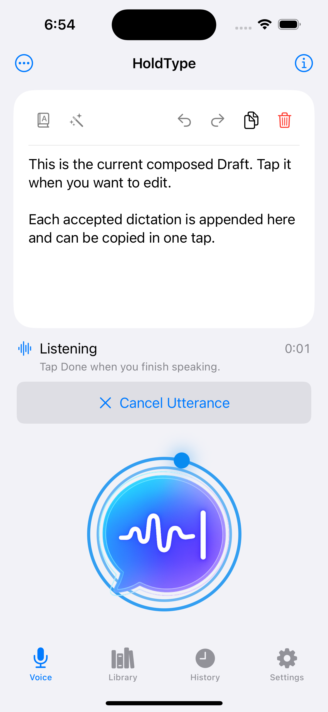
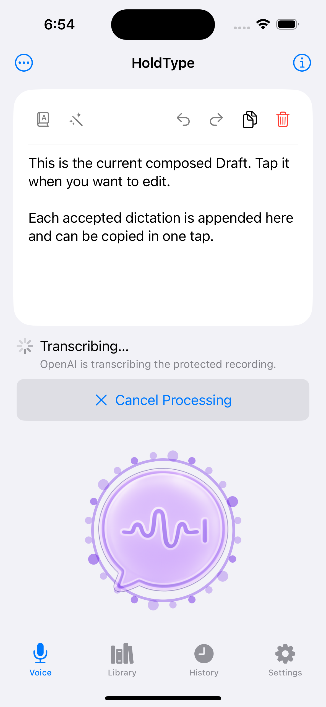

# iOS macOS Activity Control Port QA

Date: 2026-07-14

Scope: replace the iOS Voice tab's labelled Start Dictation artwork with the
text-free HoldType activity control used by the macOS floating indicator.

## Result

The primary Voice control now has two active visual phases copied from the
macOS indicator family and scaled to the existing lower-thumb target:

- Listening uses the cyan recording core, two rotating orbit lines, an
  orbiting point, and the macOS `0.78 s` pulse / `1.8 s` rotation timing.
- Finalizing and Processing use the purple transcription core, a rotating
  24-particle ring, and the macOS `1.05 s` pulse / `2.4 s` rotation timing.

Ready, setup, and recovery retain a static idle mark. No visible action text,
microphone symbol, or progress spinner is overlaid on the activity artwork.
The native Button keeps its current action label and phase as VoiceOver-only
content. Reduce Motion uses the complete static recording or transcription
artwork instead of rotating or pulsing it.

The activity control is vertically centered between equal flexible spaces in
the remaining area below the status surface. It no longer sticks to the bottom
when the screen or available content area grows; constrained layouts collapse
the flexible spaces before the surrounding ScrollView takes over.

## Visual Evidence

Both captures use iPhone 16, iOS 18.6, the DEBUG-only side-effect-free
qualification route, and `HOLDTYPE_AUTOMATION=1`. No Keychain value, live
microphone capture, or provider request was used.

## Automated Evidence

- Generic `HoldType-iOS` Simulator build: passed.
- macOS `HoldType` baseline build: passed.
- Focused `IOSVoiceHomePresentationTests`: 11 passed, 0 failed, including the
  inactive/arming/ready, listening, finalizing, and processing visual mapping.
- Asset catalog compilation: passed with the copied idle, recording, and
  transcription artwork at 1x, 2x, and 3x.
- `git diff --check`: passed.

## Evidence Boundary

Simulator evidence proves rendered phase selection, layout, asset availability,
and the deterministic state mapping. The animation is driven entirely by the
existing Voice phase and has no microphone or provider side effects. A physical
iPhone is not required to qualify this visual-only port; real recording and
provider lifecycle evidence remains owned by their existing device gates.

Tooling: xcodebuild, simctl
Runtime QA: iOS Simulator passed; physical-device pass not required
