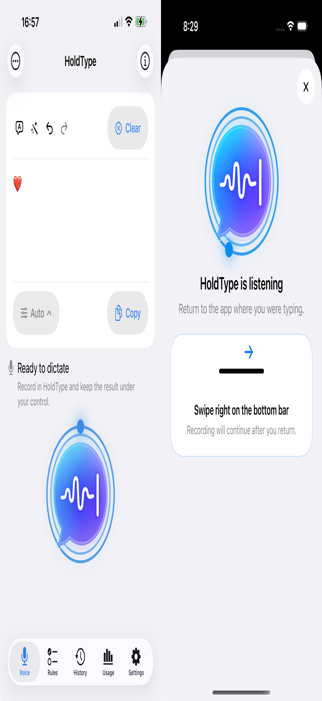
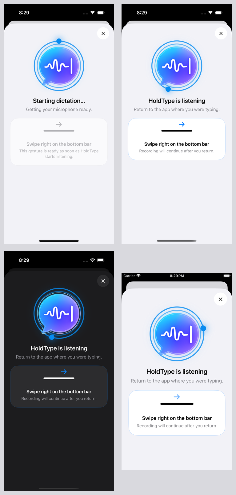
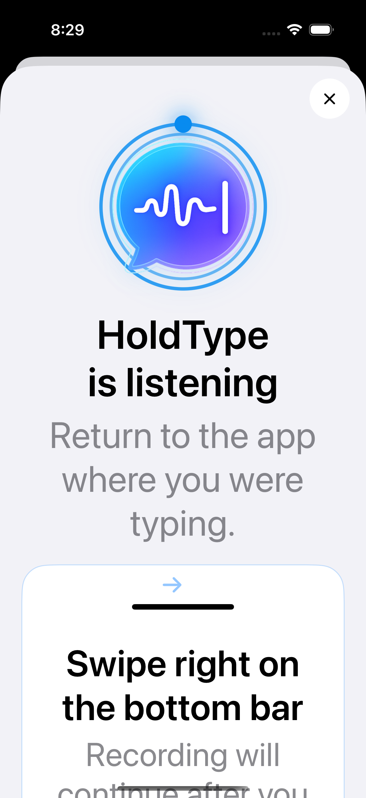

# KBD-FLOW-1 Keyboard Handoff Sheet QA

Date: 2026-07-15

Scope: the isolated Keyboard Handoff Sheet, its `starting` and `listening`
presentation states, explicit cancel behavior, accessibility behavior, and
DEBUG-only qualification routes. This checkpoint does not connect the sheet to
the production keyboard, URL routing, microphone, provider, or ordinary Voice
flow.

## Result

The isolated sheet uses the existing Voice activity indicator and presents over
the unchanged Voice surface. `Starting` keeps the return guide visually
inactive and does not claim that capture is listening. `Listening` activates a
single swipe-right guide. The close button is always available and dismisses
the qualification sheet through its injected cancel callback.

## Visual Evidence

The existing Voice screen and the new Listening sheet are shown together to
confirm visual continuity:

The state matrix covers Starting, Listening, Dark appearance, and compact width:

The accessibility Dynamic Type capture uses
`accessibility-extra-large` and remains vertically scrollable:

## Interaction And Accessibility Evidence

- Computer Use read the Simulator accessibility tree and found a distinct
  `Cancel keyboard dictation` button with its stop-and-return hint, the combined
  status text, and the swipe guide label.
- Activating that cancel button dismissed the sheet and exposed the underlying
  qualification Voice host.
- Reduce Motion selects the static arrow path; focused tests cover active,
  inactive, and reduced-motion policy branches.
- The sheet uses native text styles, a scroll container, Light/Dark semantic
  colors, and a large sheet detent. Interactive drag dismissal is disabled so
  it cannot be confused with the system return gesture.

## Automated Evidence

- `HoldType-iOS` Debug build on iPhone 16 Pro, iOS 18.6 Simulator: passed.
- Focused `IOSKeyboardHandoffSheetTests` and
  `IOSUIQualificationRouteTests`: 9 tests in 2 suites passed.
- macOS `HoldType` baseline build: passed.
- Qualification routes: `keyboard-handoff-starting` and
  `keyboard-handoff-listening`.
- Final `git diff --check`: passed before checkpoint.

## Device Boundary

Simulator evidence proves only the isolated sheet UI, qualification routing,
and injected dismissal behavior. It does not prove production app launch,
keyboard reconnection, microphone capture, background recording, signing, or
text insertion. Those remain outside KBD-FLOW-1.
