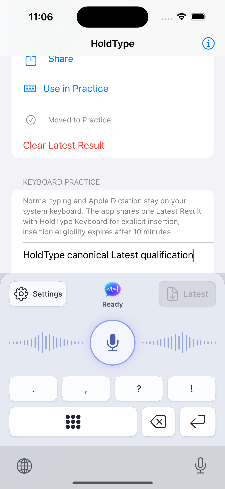
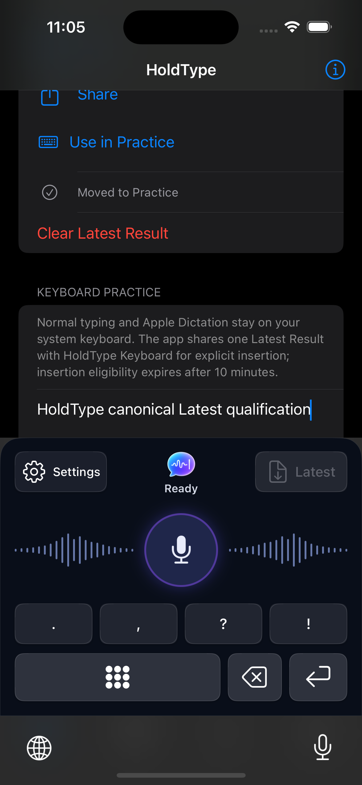

# KBD-MVP-1 Settings And App Shell QA

Date: 2026-07-14

Task: replace keyboard History with public system Settings and verify the normal
iPhone app shell.

## Automated Verification

- Focused `HoldType-iOS` test run on iPhone 16, iOS 18.6: 35 tests in 5 suites
  passed.
- Settings success requested exactly `UIApplication.openSettingsURLString`.
- Asynchronous and synchronous Settings failure both showed `Open Settings` and
  scheduled the bounded return to `Ready`.
- Presentation tests verified the Settings label, gear, accessibility text,
  minimum target size, and unchanged Light/Dark geometry.
- App-shell tests verified the stable Voice, Library, History, Settings order
  and the iPhone tab layout.
- Plist tests verified that neither app nor extension registers the removed
  `holdtype://history` scheme.
- Generic iOS Simulator Debug build: passed.
- Generic iOS device Debug build with signing disabled: passed.
- `git diff --check`: passed.

## Runtime Verification

Runtime tool: Computer Use for app and keyboard interaction; `simctl` for cold
launch, appearance selection, and durable screenshots.

- Terminated HoldType and launched `app.holdtype.HoldType.ios` without
  `HOLDTYPE_UI_QUALIFICATION` or another test route.
- The ordinary Voice root showed four permanent tabs: Voice, Library, History,
  and Settings.
- Computer Use selected History and confirmed that the tab bar remained visible.
- Computer Use focused the production practice field and switched to the real
  installed HoldType Keyboard extension.
- The keyboard showed a fully visible Settings label with a gear in both themes:

The macOS session locked after the Dark check, so Computer Use could not perform
an additional live Settings tap. The deterministic success/failure opener tests
remain the action-handling evidence. No signed physical iPhone was connected;
physical public-Settings confirmation is deferred to KBD-MVP-2 as allowed by the
plan.

Result: passed for KBD-MVP-1. No production navigation defect reproduced, so the
containing-app tab architecture was not redesigned.
